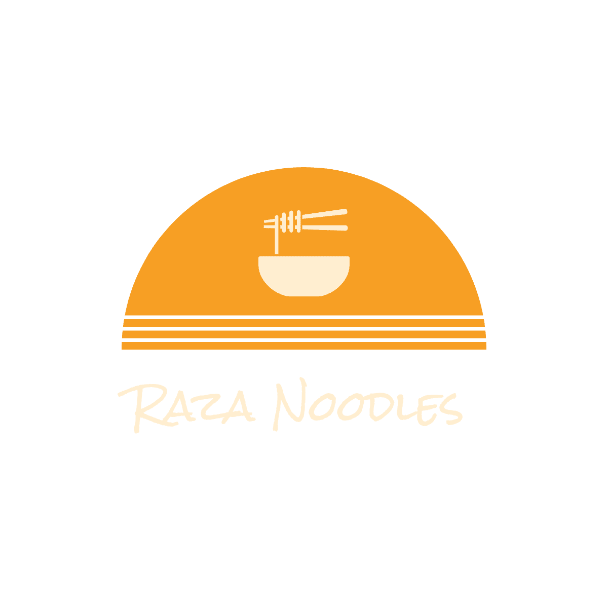

# Table of Contents

* [UX](#ux)
    * [User Stories](#user-stories)
    * [External user's goal](#external-users-goal)
    * [Site owner's goal](#site-owners-goal)
    * [Potential features to include](#potential-features-to-include)
    * [Using the five planes of UX design](#using-the-five-planes-of-ux-design)
* [Features](#features)
    * [Existing Features](#existing-features)
    * [Features left to implement](#features-left-to-implement)
* [Testing](#testing)
    * [Testing the Features](#testing-the-features)
    * [Responsive Design](#responsive-design)
    * [Validator Testing](#validator-testing)
        * [HTML5](#html5)
        * [CSS3](#css3)
        * [Lighthouse](#lighthouse)
    * [Browser Testing](#browser-testing)
* [Bugs](#tasks)
    * [Fixed Bugs](#fixed-bugs)
    * [Unfixed Bugs](#unfixed-bugs)
* [Tasks](#tasks)
* [Deployment](#deployment)
    * [Version Control](#version-control)
    * [GitHub Pages](#github-pages)
    * [How to Clone this repository](#how-to-clone-this-repository)
* [Technologies used](#technologies-used)
* [Credits](#credits)
* [Contact](#contact)
* [Acknowledgments](#acknowledgments)

# Raza Noodles

Raza Noodles is a noodle restaurant in Dublin City that specializes in Asian food with a noodle emphasis. They need to attract more clients to increase revenues and expand their business.
They employ great chefs from all over the world whose mission is to give consumers award-winning cuisine. Raza Noodles takes pride in providing a flavorful experience to Irish customers that is unlike any other on the island. This website hopes to deliver on that ambition for both Raza Noodles and the customers interested in their food.

Heres a link to the [website](https://kristiancolville1.github.io/raza-noodles/).

# UX

The theme of this website is Asian cuisine with a focus on noodles. There are many types of users this may appeal to:

*User type one: Customers interested in a dine-in experience.*

*User type two: People interested in Asian cuisine that enjoy noodles.*

## User Stories

- As a user I would like to browse the website.
- As a user I need to easily find a contact number.
- As a user it is important I can find an address.
- As a user I would like to be able to view a food menu.
- As a user I want to know the opening hours.
- As a user I want to see the foods on offer.
- As a user I need to be able to find Raza Noodles on other sites.
- As a user I would like different forms of contacting Raza Noodles.
- As a user I would like to know more about Raza Noodles.

## External user's goal

    Users of the site are interested in Asian cuisine. 

They are hungry and crave the delicious noodles Raza Noodles can provide. 

The potential customer wants to know who Raza Noodles are, what dishes they offer, how to contact them and where they are based. 

## Site owner's goal

    Raza Noodles goal is to serve tasty noodle dishes. 

They want to be a part of the online community to acquire more customers. 

The site's owner wants people to see what Raza Noodles is all about, easily access the food menu, and have a way to contact them and know where they are based.

## Potential features to include

    - Responsivity for all device users
    - Navigation bar
    - Landing page image/logo
    - Details in the design
        - A food menu and downloadable food menu
        - Competitive design to compete with the crowded market
        - Several ways of communicating with customers
        - Clear details of the opening hours
        - A showcase of actual noodle dishes
        - Links to other sites owned by Raza Noodles

## Using the five planes of UX design

Strategy

 

## Strategy
It is not possible to compete for business solely on a local level. Companies have a plethora of resources at their disposal in this day and age. One of them is to compete online by having a website that can help a business stand out in the overcrowded world of fine dining.

- Build Raza Noodles a website to connect them with customers so they can experience their Asian cuisine.
- We can address the needs of users by having a website to browse and having relevant content.

The strategy:

    - Research:
        - Check out the Market.
        - Observe the competition.
        - Find commonalities between the competition.

    - Goals to keep in mind for the website:
        - A high level of design.
        - Contrasting images.
        - Fonts and sizes.
        - The responsivity for devices.

    - Outcomes after research:
        - A food menu is top priority.
        - Gallery page is a must have.
        - Don't distract the customer with the background.
        - Images need to be carefully selected for quality.
        - Address and contact number need to be on the landing page no matter what.

 

Scope

 

## Scope
It is difficult for a developer to balance reality and content. This table ranks the design of elements 1 through 6 in order of importance. The most important is one, and the least important is six.
My potential design elements are important, but categorizing them is a useful way of completing them for the website's user.

| Features: | Users score: | Raza Noodles score: | Difference |
| --- | --- | --- | --- |
| Branding logo | 4 | 1 | 3 |
| Landing page | 1 | 1 | 0 |
| Food Menu | 1 | 1 | 0 |
| Address | 2 | 1 | 1 |
| Contact Number | 2 | 1 | 1 |
| About section | 5 | 3 | 2 |
| Opening Hours Section | 1 | 2 | 1 |
| Internal links | 2 | 3 | 1 |
| external links | 6 | 1 | 5 |

 

Structure

 

### Structure
These are the structure targets of the website.

Targets: 

- Navigation for the website
    - Menu bar.
    - Ease of access.
    - Digestible content.
- Different web pages for content
    - Home page.
    - Food menu.
    - Contact page.
        - Contact details.
        - Map for location.
        - Reservations.
    - Gallery page showcasing food.
    - Sign in/up page.
    - Policy pages for terms, privacy and cookies.
- Relevant sections
    - Address and location.
    - About Raza Noodles.
    - Food menu section.
    - Opening Hours.
    - Footer with links to external pages.
- Downloadable content
    - Food menu.

 

Skeleton

 

### Skeleton
Wireframes were created using [Balsamiq](https://balsamiq.com/).
Here is the PDF that I made for this UX plane: [KC Wireframes](/assets/media-files/raza-noodle-wireframes.pdf)

I created this website as a desktop first website and worked backwards to create it on smaller screens. You can see what I did to do this in the [Responsive Design](#responsive-design) section.

 

Surface

 

### Surface

#### Colors

Food is frequently connected with the colors orange and purple. The website's colors represent the fact that this is a food business.

Orange and purple are also excellent color contrasts.

For the major contrast on the website, I used two darker hues. Dark purple with a hint of orange peel. The two are a perfect complement.

All the colors chosen for Raza Noodles are listed below. For all pages, the color black was also applied to increase the accessibility score. Against most hues, black is the easiest to read. Because my off-white hue didn't work well in the footer, I went with black.

Logo, menu items & icons: 

    - Orange Peel.

Background:

    - Dark Purpel.

Footer: 

    - Black social media icons for accessibility reasons and 
    - Lavender Floral background.
    - Orange Peel when hovered over.

Scroll icons on hover:

    - Rose Madder.

Text:

    - Baby Powder.

#### Fonts

The fonts chosen were [Luxurious Roman](https://fonts.google.com/specimen/Luxurious+Roman#glyphs) and [Rock Salt](https://fonts.google.com/specimen/Rock+Salt). Both sourced from [Google fonts](https://fonts.google.com/).

The logo, headings and titles:

    - Rock salt

The text:

    - luxurious Roman

 

[Back to top](#table-of-contents)

# Features

## Existing Features

Landing page

 
On the main home page is the logo and logo fade design. 

- The user can see a contact number and address. 

- A scroll icon helps bring the user to the next section and it has an arrow to indicate the direction of navigation and is also helped with the use of a CSS animation I implemented. 

The menu bar features in the top right corner, this is a modern and intuitive design.

- The logo is also present in the top left corner and has a link to the home page. 

- All sections, internal links and external links are either present on the landing page or can be indicated to.

 

Navigational Menu

 
Included on all internal pages at the top of the page. Allows access to internal links and the different sections on the home page.

Includes:

    - Pages to internal links.
        - Logo.
        - Home page.
        - Menu page.
        - Gallery page.
        - Contact page.
        - Sign in page.
    - Downloadable pdf documents.

 

Hamburger Menu

 
This was a fun feature to create. 

I'm proud of the fact that it's all HTML5 and CSS3. I could have used a script for this with bootstrap but I felt the purpose of this project for myself as the developer was to stretch my coding muscles in HTML5 and CSS3.

Users with smaller screens (881px wide and below) can use a hamburger menu with this feature.

- When there are several menu selections, it helps the website maintain structural integrity. I have multiple menu options available to the user. It was needed if I wanted to be able attempt to make it responsive and cosmetically appealing. 

 

Download dropdown Menu

 
This allows the user the option of downloading the menu and keeping it. The dropdown menu currently has two pdf files for download by the websites user.

Includes:

    - Downloadable pdf documents.
        - Food Menu.
        - Terms and conditions.

 

Fixed footer

 
Allows the user to see available links to other Raza Noodle social media and the generated policy pages.

Includes:

    - Links to external websites.
        - Facebook.
        - Twitter.
        - Instagram.
        - Linkedin.

These policy pages were created using a generator are not my own work. After completing the scope for the UX design I decided these pages were the least of my worries. They are essentially cosmetic. The project has a deadline and I do not have the time to build these. Using a generator saved time for other aspects of the website. These policy pages were created using [TermsFeed](https://www.termsfeed.com/).

- They include relevant content you might find on other websites.

    - Terms of use.
    - Privacy policy.
    - Cookie policy.

 

Scroll Icons

 
Allows the user the option to scroll down to the relavent sections on all internal pages.
The icons contain links that bring the user to the next section where pages are longer.

 

About Section

 

Gives us some information about Raza Noodles and the food.
It shows us some of the meals Raza Noodles is capable of creating helping to perhaps peek the website users interest.

Includes:

    - Description of Raza Noodles.
    - Photos of real noodle dishes.

 

Opening Hours section

 
This section allows the user of the website to see opening hours for Raza Noodles. 

- It features a fixed background and the text is wrapped in another background to make it visually easier to read for the user.

 

Menu Page

 
The second internal page after the home page is the menu page. It features some of the information from the home page such as the address and phone number. It has one of my scroll icons to go further down the page. 

This helps add cohesiveness to the design for the user, they are shown the address and phone number again after landing on the home page this is where they might go next if they are interested in browsing for options to eat when they arrive at Raza Noodles.

The background effect consists of an animation written in css that comes forwards. The background has an orange color effect. This was done with a background blend mode style property I found in [CSS documentation](https://devdocs.io/css/).

 

Food Menu

 
On the menu page we also have the actual food menu. This allows the user to see what options are available to them and fufills design requirements by Raza Noodles for a competitive design.
The food menu has multiple images and relevant content in the menu for the user to explore.

- At the beginning of the food menu theres a second option for downloading the food menu.

- The link in the menu bar shows a 3 piece menu and it helps make the menu page cohesive when navigated to.

- The menu presents the illusion that it is a three-piece fold out menu on larger screens.

- Animations have been included to show different noodle dishes.

- On medium screens its a two-piece fold out menu and having the inset border in between each section creates these classic menu looks whilst adding abit of creativity.

- For small screens the menu becomes a single column and shows how adaptible this food menu is. The food menu section has 3 major shift changes overall for different screen sizes.

- The user can view this menu to decide what they might buy when visiting Raza Noodles.
    - The website has content the user would like to explore if dining out here.

 

Gallery Page

 

Another internal page included is the gallery page. This allows users to see Raza Noodle photos and get to see some foods prepared by Raza Noodles.

 

Contact page

 

This feature allows users to send Raza Noodles a message and is another way to reach them. 

- The user must fill in their personal information correctly to be able submit feedback, and the page instructs them on how to do so.
    - Alerts the user for example if an entry is missing or an email is invalid.

- It is a dummy form that allows the user to share their experience while also allowing Raza Noodles to 'possibly' receive feedback. 

 

Thank you page

 

After the user submits a message through the dummy form to Raza Noodles on the contact page a new internal page opens presenting the illusion that the user is still on the same page.

- It gives the user a response saying thank you. 

- It has a second option to return to the home page right below the thank you message.

- It is, at the very least, a pleasant feature that is just cosmetic but gives the site a more legitimate appearance for the user.
    - The user is kept on the website instead of their browser reporting the error and a blank screen, which helps to keep retention of the user.

 

Animations

 

The Raza Noodle logo has an animation on the home screen. 

- For the user, this animation adds some elegance to the landing page on their arrival each time they visit the home page.

The second animation is on the menu landing page. 

- The backgroud has a color effect done with background blend mode in css. It shows the background scale up when the user goes to this page.

The third animation is on the food menu. It features two image containers that switch between images every 9 seconds, there is also a delay added so the user will get to see multiple images after going to this section. 

- The user gets to see different dishes made by Raza Noodles
    - Provides insights to the type of dishes.
    - What they might look like when prepared.
    - The quality of the food.

 

Sign in page

 

- Users can log in or create an account on the website. 

- The user must fill in their personal information correctly to be able sign in or sign up, and the page instructs them on how to do so.

There are two forms for the sign-in options.

- The user is directed to our 404 error page after completing the form. 

Raza Noodles currently does not have any servers available to handle user data. 

More information about this may be found in the features that still need to be implemented. [Features left to implement](#features-left-to-implement).

 

404 error page

 

As mentioned previously for the sign in page the 404 error page is displayed when the user completes a sign in option.

- Its mostly decorative with the intent of being a message Raza Noodle can choose to display. 

I chose to alert the user that currently the server is down and to check back again later. 

- It also provides the user with away back to the home page after an error occurs.

- It helps the user know this is a legitimate website by having its own 404 error page.

 

Downloadable content, Address and phone number

 

The website features 3 ways the user can view the menu; The drop down menu option for download, the food menu page, & the option for download in the food menu. All providing the user a content rich menu to explore.

- Raza Noodles' address and phone number can be found on the landing page and menu page. 

- I've included html code that allows the user to dial the phone number just by pressing it.

Raza Noodles needs the ability for users to call them when they visit the website. 

- The user will be asked if they wish to call the number by just tapping the number.
    - I've indicated this by placing a calling icon next to the phone number.

To help the user understand that this is a calling feature, it is the same color as the menu options.

 

## Features left to implement

This is a static website.

- The website makes extensive use of just HTML5 and CSS3.
    - I would like to see JavaScript implemented throughout the site in later editions.

The aspirations listed below are currently outside the scope of this project. 

- I either don't have the skills to integrate these features yet or haven't been able to find the resources on time.

They can't be executed in most cases since they are outside of my present time frame and/or demand me to learn new abilities that I don't have time on hand to learn at the moment.

- When starting from scratch, building and launching a smartphone application, for example, could take weeks. These would take time to build, but with careful planning and the acquisition of the necessary skills, they could be done.

### Aspirations for this website

- A smartphone application.
    - To compete with other businesses.

- An online delivery service.
    - Allowing the user to place an order via the internet.

- A system for making payments.
    - Reservations, bookings, and online orders.

- A cookie pop-up banner.
    - Request permission to use cookies.

- A pop-up banner for COVID19.
    - Inform the user of any current health policies, alternative opening hours, or guidelines.

- Advertising.
    - Increase revenue by showing advertisements to users.

- Web-based servers.
    - Cloud technology.
    - Take care of traffic and data management.

- Analysis of user data.
    - Recognize patterns and forecast future events.

- More menu options/pages.
    - Reservations, online delivery,  etc.

[Back to top](#table-of-contents)

# Testing

## Testing the Features

Landing page

 

Testing for:

    - Navigation abilites of the home page.
    - Placement of contact details.
    - Placement of Raza Noodles address.

Testing results:

- On the landing page the user can see all options available to browse the website.

- The contact number is on the landing page.

- The address is on the landing page.

User stories fufilled:

    - As a user I would like to browse the website.
    - As a user I need to easily find a contact number.   
    - As a user it is important I can find an address.
    - As a user I need to be able to find Raza Noodles on other sites.

 

Navigational Menu

 

Testing for:

    - Navigation abilites of the Menu bar.
    - Menu options.
    - Access to the food menu and relevant sections.

Testing results:

- Placed at the top of every page is a navigational menu allowing the user to pick different options for browsing the website.

- Home, About, Menu, Gallery, Contact, Sign in, and download options.

- There's two options for viewing the menu from the menu bar, included is an internal page to a food menu and in the right hand corner an option to download the food menu to view it.

- The menu features an option for 'About' which informs the user of the option to know more about Raza Noodles.

- When hovered over the menu options change color indicating where the user has either clicked or has their mouse pointer.

- The links also maintain a line underneath to indicate the users relative position within the website.

User stories fufilled:

    - As a user I would like to browse the website.
    - As a user I would like to be able to view a food menu.
    - As a user I would like to know more about Raza Noodles.

 

Hamburger Menu

 

Testing for:

    - Navigation abilites of the website.
    - Functional abilites.
    - Intent.

Testing results:

- On smaller screens 881 pixels wide and lower the menu turns into a hamburger menu, it allows the user to navigate the website while maintaining its structural integridy.

- The user can press this button to display available options to browse the website.

- The hamburger menu is styled deliberately as three lines as this is a common design for this type of menu.
    - Color contrast for the hamburger menu so it is visable.
    - Ensuring the user understands its purpose & intent.
    - It follows user design priciples.

User stories fufilled:

    - As a user I would like to browse the website.

 

Download dropdown Menu

 

Testing for: 

    - Navigational abilities of the menu bar.
    - Functionality.

Testing results:

- The user can browse through available download options on Raza Noodles website.

- When the user hovers over the menu option for 'downloads' they can download the food menu allowing them to keep and view the food menu.

User stories fufilled:

    - As a user I would like to browse the website.
    - As a user I would like to be able to view a food menu.

 

Fixed footer

 

Testing for: 

    - Navigational abilites.
    - Placement of links.
    - Functional abilites.

Testing results:

- The footer is fixed and can be viewed always and is seen on all internal pages.

- The user can click on all available options, all are working correctly and opening external pages.

- If other Raza Noodle sites existed this would allow them to view additional Raza Noodle external web pages.

- When hovered over the links change color indicating where the user has either clicked or has their mouse pointer.

User stories fufilled:

    - As a user I need to be able to find Raza Noodles on other sites.
    - As a user I would like to browse the website.

 

Scroll Icons

 

Testing for: 

    - Scrolling abilites.
    - Navigation.
    - Purpose.

Testing results:

- Placed centrally on the screen is scroll icon one, it features on the home page and menu page allowing the user to go to the next section instantly.

- The pages implemented with this feature are the home page & menu page.

- To help indicate it's purpose an animation was added that 'blinks' every 1.5 seconds to alert the user of a quick navigational option
where pages are longer.

- On the home page there are two scroll icons, the second one brings the user to the opening hours section so they can view opening hours.

- Its purpose is understood.
    - It points in the direction of navigation.

User stories fufilled:

    - As a user I would like to browse the website.
    - As a user I want to know the opening hours.

 

About Section

 

Testing for: 

    - Navigation.
    - Purpose.
    - Relevant content.

Testing results:

- The user can browse to the about section from the menu bar and get there by either scrolling manually or with the scroll icon that is implemented.

- This section also features 3 images which show tasty noodle dishes allowing the user to view some of Raza Noodles freshly prepared dishes.

- i have included information about who Raza Noodles are, what their all about and what they guarantee in terms of quality.

User stories fufilled:

    - As a user I would like to browse the website.
    - As a user I want to see the foods on offer.
    - As a user I would like to know more about Raza Noodles.

 

Opening Hours section

 

Testing for: 

    - Navigation.
    - Location.
    - Relevance.

Testing results:

- Leading on from the about section is another scroll icon that will bring the user to opening hours section allowing the user to browse the website.

- A user can view the opening hours for Raza Noodles on the home page in the last section of the page.

- Users are able to find it by briefly searching the home page.

User stories fufilled:

    - As a user I would like to browse the website.
    - As a user I want to know the opening hours. 

 

Menu Page

 

Testing for:
    
    - Navigation abilites.
    - Relevance.
    - Purpose.

Testing results:

- The second internal page is the menu page and can be indicated to from the home page. The user of this site can navigate to this area thus allowing them to browse the website.

- The menu links work correctly, bringing the user to the internal menu page which has the food menu section.

- Placed under the main image on this page the address and phone number are both visable for the user.

User stories fufilled:

    - As a user I would like to browse the website.
    - As a user I need to easily find a contact number. 
    - As a user it is important I can find an address.
    - As a user I would like to be able to view a food menu.

 

Food Menu

 

Testing for: 

    - Navigation.
    - Relevance.
    - Function.

Testing results:

- On the menu page is a section for the food menu. The user of this site can navigate to this area thus allowing them to browse the website.

- The user has multiple options to view a food menu, the downloadable link in the menu bar, the downloadable link in the food menu and the actual food menu on the menu page.

- Animations showing different dishes Raza Noodles offers allows the user to see meals offered.

- The menu layout is your standard menu, it has soups, appetizers, mains, favourite dishes, and special dishes.

- Users can browse through all the meals and see their prices.

User stories fufilled:

    - As a user I would like to browse the website.
    - As a user I would like to be able to view a food menu.
    - As a user I want to see the foods on offer.

 

Gallery page

Testing for: 

    - Navigation.
    - Relevance.

Testing results:

- Users are able to navigate to the gallery page through the menu bar.

- Any user of the website interested in seeing noodle dishes can view many different photos from the gallery page.

- The images are mostly noodle dishes allowing the user to get overall sence of Raza Noodles capabilites.

User stories fufilled:

    - As a user I would like to browse the website.
    - As a user I want to see the foods on offer.

Contact page

 

Testing for: 

    - Relevance.
    - Function.

Testing results:

- On the contact page is a dummy form as previously mentioned in the feature section. It allows the user to send a message to Raza Noodles to inform them of how they are doing.

- The website won't progress further though unless the user enters the correct details such as a valid email address.

- On completion the user is taken to our thank you page.

- The user is able to browse to the contact page through the menu bar and is easily navigated to.

User stories fufilled:

    - As a user I would like to browse the website.
    - As a user I would like different forms of contacting Raza Noodles.

 

Thank you page

 

Testing for: 

    - Navigation.
    - Functional abilty.

Testing results:

- On completion of the contact form the user is taken to our thank you page.

- The user can navigate back to the home page quickly by pressing the 

User stories fufilled:

    - As a user I would like to browse the website.
    - As a user I would like different forms of contacting Raza Noodles.
 

Animations

 

Testing for: 

    - Navigation of the website.
    - Functional ability.

Testing results:

- The logo on the home page increases in opacity as expected upon entering the website.

- The user can navigate to these sections containing the animations.

- As mentioned previously the scroll icon animation behave as expected, blinking every second or so pointing in the direction of navigation.

- The user can see this on entering the Raza Noodle website.

- During a viewing of the food menu the user will notice images change on the website so they can see different dishes.

User stories fufilled:

    - As a user I would like to browse the website.
    - As a user I want to see the foods on offer.

 

Sign in page

 

Testing for: 

    - Navigation of the website.
    - Functional ability.

Testing results:

- Feature not fully implemented as mentioned in [Features left to implement](#features-left-to-implement).

- Behaves as expected and brings the user to our 404 error page.

- Alerts the user that a server is down and they are unable to create an account or log in.

- Users can easily navigate to this section.

User stories fufilled:

    - As a user I would like to browse the website.
    - As a user I want to see the foods on offer.

 

404 error page

 

Testing for: 

    - Navigation.
    - Function.

Testing results:

- Users trying to sign in will be taken to this page upon completition of either of the dummy forms.

- When on this page they have a quick way back to the menu with a link back to the home page underneath the 404 error message.

- It is a common error page on websites and helps cement that this is a legitimate website to the user.

User stories fufilled:

    - As a user I would like to browse the website.

 

Downloadable content, Address and phone number

 

Testing for: 

    - Navigation.
    - Function.

Testing results:

- When users click on the phone number it allows them the ability to instantly call Raza Noodles.

- The number is safe to use and not a real phone number.

- Users can easily find the phone number on two pages in the same general location.

- The address is also in the same locations. Its purpose is understood easily by the user. 

User stories fufilled:

    - As a user I would like to browse the website.
    - As a user I need to easily find a contact number.
    - As a user it is important I can find an address.

 

[Back to top](#table-of-contents)

## Responsive Design

I was able to make the website responsive by primarily using pixels and percentages. The maximum screen sizes, which I implemented, allow the site to adapt to various user screens.
[Chrome Developer Tools](https://developer.chrome.com/docs/devtools/) was the tool I used to make the site responsive.

- Many features were not affected until certain widths were reached and those are indicated as n/a.

These adjustments did not apply to the external pages because the policys were created using a generator. External links to other websites were not included in the adjustments because I don't own those websites.

- Personal breakpoints for the website are also denoted with 'pbp'. 

The most work needs to be done on the Menu page, which was done on purpose because it is a key feature of the Raza Noodles website. 

The Menu page layout changes dramatically for different screen sizes. It was the most challenging to make responsive, but personal breakpoints made it incredibly adaptable.

Below are set widths provided by chrome developer tools, I also used other max widths but have not included them in the table to improve the readability.

| features / widths | 1920px | 1440px | 1024px | 768px | 425px | 375px | 320px |
| -------------------- | --- | --- | --- | --- | --- | --- | --- |
| Menu                 | Shown | Shown | Shown | Hidden | Hidden | Hidden | Hidden |
| Hamburger menu        | Hidden | Hidden | Hidden | Shown | Shown | Shown | Shown |
| logos                | n/a | n/a | n/a | Adjusted | Adjusted | n/a | n/a |
| Landing page         | n/a | n/a | n/a | Adjusted | Adjusted | Adjusted | n/a |
| Dropdown menu        | n/a | n/a | n/a | Adjusted | Adjusted | n/a | n/a |
| Logo fade            | n/a | n/a | n/a | Adjusted | Adjusted | Adjusted | n/a |
| Scroll icons         | n/a | n/a | n/a | Adjusted | Adjusted | Adjusted | n/a |
| About section        | n/a | n/a | n/a | Adjusted | Adjusted | Adjusted | n/a |
| Opening hours section | n/a | n/a | Adjusted | Adjusted | Adjusted | n/a | Adjusted |
| Footer               | n/a | n/a | n/a | Adjusted | Adjusted | Adjusted | n/a |
| External Links       | x | x | x | x | x | x | x |
| Menu page            | pbp | pbp | pbp | pbp | pbp | pbp | pbp |
| Gallery page         | n/a | n/a | n/a | Adjusted | n/a | pbp | n/a |
| Sign in page         | n/a | n/a | n/a | Adjusted | n/a | Adjusted | n/a |
| Thank you page       | n/a | n/a | n/a | Adjusted | n/a | n/a | n/a |
| Contact page         | n/a | n/a | n/a | pbp | Adjusted | n/a | n/a |
| 404 page             | n/a | n/a | n/a | n/a | n/a | n/a | n/a |

I experimented with many approaches for making the site responsive and discovered that using pixels was the most accurate and straightforward method for converting the various items on the pages to a suitable format for each screen size. Because the different portions of this website are all positioned 'absolute,' it made the most sense to use pixels to make it responsive. By doing it this way, I was able to save time. Because of this design, the screen's height is irrelevant.

I tried using viewport height as the unit of measurement for elements on the page, but it had an unacceptably large impact on structural integrity. I can see how these units of measurement could be really useful.
It's just trying to keep the responsive design in mind, which is tricky with viewport height and width. For starters, different gadgets come in a variety of heights and widths. If this design was for a specific device I would find those units of measurement very handy to have.

## Validator Testing
### HTML5

All internal pages passed official [W3C Validator testing](https://validator.w3.org/nu/#textarea). The policy pages are excluded as they are were generated. I tested my pages by putting the URL of each page into their HTML checker.

I corrected all problems the html checker indicated. The html checker pointed out missing aria labels, incorrect id's, classes and semantic issues. All were corrected thanks to this useful tool.

### CSS3

Css passed official [W3C Validator testing](https://validator.w3.org/nu/#textarea).
I ran a direct input check on my CSS file and found no errors. There were no warnings or mistakes in my CSS code that I needed to fix. I was able to get everything fully correct.

### Lighthouse

All the pages were tested with [Chrome Developer Tools](https://developer.chrome.com/docs/devtools/) using the [Lighthouse](https://developers.google.com/web/tools/lighthouse) resource.

- Performance:

    - To improve performance I limited the number of images on all pages.

    - Most images were resized and reformated to reduce data consumption.

    - Went as feasibly low in quality for the images without damaging the cosmetic appeal of the website.

    - High scores throughout the website.

- Accessibility: 

    - Colors were changed in the footer and background for all pages for better contrast.

    - Font sizes were adjusted.

    - Placement of headings adjusted where possible.

    - Missing alt/aria labels added to forms and images.

- Best Practices:

    - Displayed images either are or are near the correct aspect ratio.

    - HTMl doc type included in the html for all pages.

    - All links to external websites have the attribute 'noopener' allowing safe browsing.

- Search Engine Optimization:

    - Semantic HTML included in all internal pages created.

    - IDs added to sections.

    - All links have descriptive text added.

    - Alt attributes added to their respecitve images.

    - Meta data descriptions added to each internal page created.

    - All font sizes are 100% legible text.

Home page

 

Menu page

 

Contact page

 

Gallery page

 

Sign in page

 

404 error page

 

Thank you page

 

## Browser Testing 
- Page behaves as expected in all browsers tested. The website was tested in [Chrome](https://www.google.com/intl/en_ie/chrome/), [Fire fox](https://www.mozilla.org/en-US/firefox/new/), [Edge](https://www.microsoft.com/en-us/edge) and [Opera](https://www.opera.com/?utm_campaign=%2300%20-%20WW%20-%20Search%20-%20EN%20-%20Branded&gclid=CjwKCAiA3L6PBhBvEiwAINlJ9N99KoEo-3uTFKvHKizeKfFlvMpgMJo-JwFBIPSYZUm_LixSy4s3NxoCc5cQAvD_BwE).

# Bugs

## Fixed Bugs

The only major issue encountered was making the site responsive. I did not fully understand viewport height as a unit of measurment when I began building the project and it led to time being taking up to fix my mistake. I had to go back and change a lot of css code to use percentages and pixels as units of measurements. I mananged to fix it by tracking all my measurements correctly.

## Unfixed bugs

On small displays, the fixed background inside the food menu will not function. I looked on StackOverflow and everywhere else for help with this problem. I figured out it had a lot to do with my elements' parent-child relationship being set to 'absolute,' but I ran out of time to figure it out, so I simply put in a quick workaround that seemed to work. At lower screens, I changed the background attachment's value, and while it's not as fixed as it is on larger screens, it's at least operating as I intended.

[Back to top](#table-of-contents)

# Tasks

| Task to be completed | not finished | completed |
| -------------------- | ------------ | --------- |
| Create logo icons    |              | x         |
| Landing page         |              | x         |
| Dropdown menu        |              | x         |
| Logo fade            |              | x         |
| Scroll icons         |              | x         |
| About section        |              | x         |
| Opening hours section |             | x         |
| Footer               |              | x         |
| External Links       |      n/a     |     n/a   |
| Menu page            |              | x |
| Gallery page         |              | x |
| Contact page         |              | x         |
| Thank you page       |              | x         |
| sign page            |              | x         |
| 404 page             |              | x         |
| README               |              | x  |

[Back to top](#table-of-contents)

# Deployment

## Version Control

I used [GitPod](https://www.gitpod.io/) as a local repository and IDE & [GitHub](https://github.com) as a remote repository.

1. To begin with, I needed to create a new repository on GitHub [raza-noodles](https://github.com/KristianColville1/raza-noodles).
2. Then I opened that repository on GitPod by prefixing 'gitpod.io/' at the start of the URL in Github when I was in the repository.
3. GitPod opened a new workspace for me.
4. I created some files and folders.
5. To push my newly created files to GitHub I used a Bash terminal:

    *   **git add (name of file)** *This selects the file for the commit*
    *   **git commit -m "Commit message: (i.e. Initial commit)"** *Allows the developer to assign a specific concise statement to the commit*
    *   **git push** *The final command sends the code to GitHub*

## GitHub Pages

When I finished the homepage for Raza Noodles, I looked for a way to deploy the website. As a deployment solution, I chose the version control system [GitHub](https://github.com). They have an excellent resource called [GitHub pages](https://pages.github.com/) that allows developers to visually inspect how their website would look on a cloud platform.

1. To begin, I went to the repository and selected 'settings.'
2. I went to the 'pages' section.
3. I chose the master branch as the 'main' branch under 'source.'
4. I ensured that it was deployed from the 'root' directory.
5. Once completed, I got the website's URL.

## How to clone this Repository

Heres six steps to clone the repository: 

1. Log into your [GitHub account](https://github.com/).
2. Create a new repository and give it a name.
3. At the top of this repository click the green button labelled code.
4. Click on HTTPS option and copy the URL link to your clipboard.
5. Open your chosen [IDE](https://www.codecademy.com/article/what-is-an-ide), please note [git](https://git-scm.com/) must be installed.
6. Open your terminal in the IDE and type: git clone the-URL-from-here.

Congradulations you now have a clone of this repository on your local machine.

[Back to top](#table-of-contents)

# Technologies used

- [HTML5](https://en.wikipedia.org/wiki/HTML5) for the contents and structure of the website.
- [CSS3](https://en.wikipedia.org/wiki/CSS) for the styling and animations.
- [Balsamiq](https://balsamiq.com/) for wireframing.
- [GitPod](https://gitpod.io/) as a local IDE & repository.
- [GitHub](https://github.com/) as a remote repository.
- [GitHub Pages](https://pages.github.com/) to deploy the website.
- [Chrome](https://www.google.com/intl/en_ie/chrome/), [Fire fox](https://www.mozilla.org/en-US/firefox/new/), [Edge](https://www.microsoft.com/en-us/edge) and [Opera](https://www.opera.com/?utm_campaign=%2300%20-%20WW%20-%20Search%20-%20EN%20-%20Branded&gclid=CjwKCAiA3L6PBhBvEiwAINlJ9N99KoEo-3uTFKvHKizeKfFlvMpgMJo-JwFBIPSYZUm_LixSy4s3NxoCc5cQAvD_BwE) for browser testing the responsiveness.
- [Chrome Developer Tools](https://developer.chrome.com/docs/devtools/) for testing screen sizes and using [Lighthouse](https://developers.google.com/web/tools/lighthouse).
- [TermsFeed](https://www.termsfeed.com/) to build my policy pages.
- [Favicon.io](https://favicon.io/favicon-generator/) to create a flavicon for Raza Noodles.
- [Grammerly](https://app.grammarly.com/) for checking my content and writing.
- [Quillbot](https://quillbot.com/) for paraphrasing my writing.
- [Coolors](https://coolors.co/) for creating a color palatte to use.

[Back to top](#table-of-contents)

# Credits

## Content

### Fonts
Google has a wide varity of free fonts for use. I chose the two fonts for my projects from [here](https://fonts.google.com/).

### Terms of Use, Privacy Policy, Cookies Policy
I used a generator to build my policies from [TermsFeed](https://www.termsfeed.com/).

### Food menu items

   * The soups for my food menu were sourced from [bonappetit](https://www.bonappetit.com/recipes/slideshow/noodle-soup).

   * The appetizers for the menu were sourced from [insanelygoodrecipes](https://insanelygoodrecipes.com/asian-appetizers/).

   * The main dishes on the menu were sourced from [Jamie Oliver](https://www.jamieoliver.com/recipes/category/world/asian/).

   * The special noodle dishes on the menu were sourced from [bbc good food](https://www.bbcgoodfood.com/recipes/collection/noodle-recipes).

## Media

### The logo
I created the branding logo with help from here [hatchful.shopify.com](https://hatchful.shopify.com/).
I tried to keep in mind that this was an Asian style restaurant and chose the appropriate design for the logo after careful consideration.
The logo features an icon that intuitively shows a bowl of noodles and chopsticks.

### Icons
All of the icons were sourced from [fontawsome](https://fontawesome.com/v5.15/icons?d=gallery&p=2&m=free).

### Images
The images on the website all came from [Pexels](https://www.pexels.com/).

# Contact

My name is [Kristian Colville](https://github.com/KristianColville1) i am a full-stack software developer student at [Code Institute](https://codeinstitute.net/ie/), where I am pursuing a QQI Level 6 Diploma in Full Stack Software Development.

Please do not hesitate to contact me if you require any additional information about this project or wish to discuss work/collaboration opportunities.

- [LinkedIn](https://www.linkedin.com/in/kristian-colville-711727133/)
- [GitHub](https://github.com/KristianColville1)
- Phone: <a href="tel:083-393-7493" target="_blank" rel="noopener" aria-label="Click here to call Kristian Colville">+35383-393-7493</a>
- Email: <a href="mailto:kristiancolville1@gmail.com" target="_blank" aria-label="Click here to email Kristian Colville">kristiancolville1@gmail.com</a>

# Acknowledgments

A big shout out to [Code Institute](https://codeinstitute.net/ie/) for providing me with the opportunity to create this project.

I'd like to thank my mentor [Spencer Barriball](https://github.com/5pence) for his invaluable guidance and for reviewing my website.

[Erik Terwan](https://codepen.io/erikterwan/pen/EVzeRP) for this helpful hamburger menu idea written in just HTML and CSS.

[Back to top](#table-of-contents)
